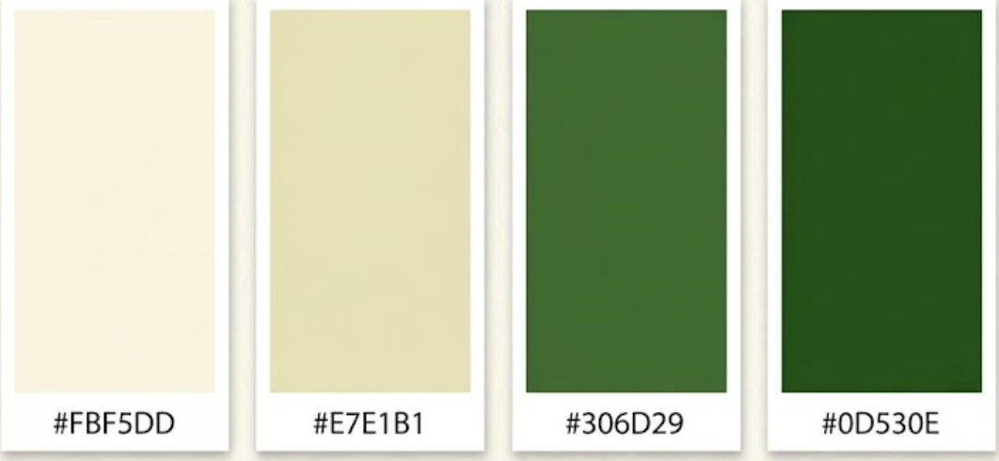
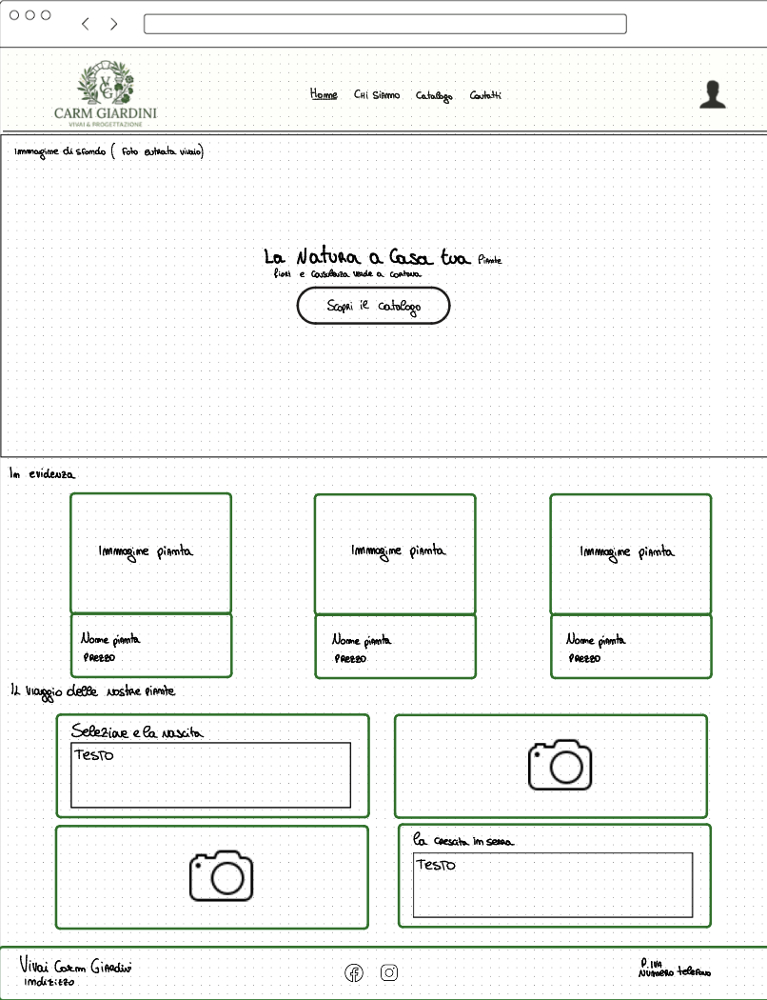
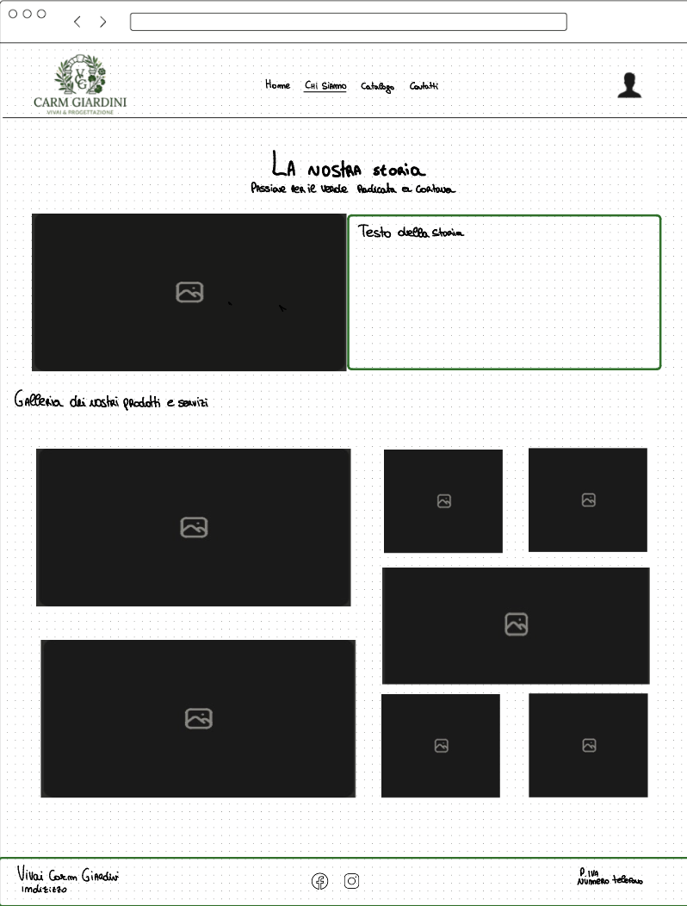

# Vivai Carm Giardini

Sito web per un vivaio, pensato sia come sito vetrina per i clienti sia come strumento di gestione per lo staff.

L'obiettivo del progetto e' permettere ai clienti di consultare informazioni sulle piante e aiutare gli operatori del vivaio nella gestione del magazzino. Ogni pianta puo' essere associata a un QR code o a un barcode: una volta scannerizzato, il codice apre una pagina dedicata alla pianta.

## Aree del progetto

Il progetto e' diviso in due aree principali:

- Area pubblica: sito vetrina accessibile a tutti.
- Area privata: area staff protetta da login per gestione piante e magazzino.

## Funzionalita principali

- Navigazione pubblica con Home, Chi siamo, Catalogo e Contatti.
- Catalogo piante con ricerca testuale e filtro per categoria.
- Login staff con autenticazione tramite cookie.
- Dashboard privata con elenco piante.
- Vista desktop a tabella e vista mobile a card verticali.
- Creazione e modifica delle piante tramite popup.
- Generazione di QR code e barcode per ogni pianta.
- Popup di anteprima codice con possibilita' di stampa.
- URL specifico per ogni codice, ad esempio `/gestione-pianta?id=123`.

## Pagine pubbliche

### Home

La home presenta il vivaio con una grande immagine di sfondo, il titolo "La natura a casa tua", un sottotitolo e un pulsante per accedere al catalogo.

Include anche:

- sezione "In evidenza" con piante di stagione consigliate;
- card con effetto hover per mostrare la descrizione;
- sezione "Il viaggio delle nostre piante" con immagini e testi alternati.

### Chi siamo

Pagina dedicata alla storia del vivaio.

Contiene:

- intestazione con titolo e sottotitolo;
- sezione "Le nostre radici";
- immagine del fondatore;
- gallery fotografica con effetto zoom.

### Catalogo

Pagina con elenco delle piante disponibili.

Contiene:

- barra di ricerca;
- menu a tendina per filtrare le categorie;
- griglia prodotti caricata tramite API Node.js;
- card con immagine, nome, prezzo e disponibilita'.

### Contatti

Pagina con:

- form di contatto;
- mappa Google Maps;
- telefono, email e orari.

### Login

Pagina di accesso per lo staff.

Contiene:

- form centrato;
- campi username e password;
- invio dati al server Express.

### Anteprima Pianta

Pagina pensata per mostrare al cliente la pianta scannerizzata.

Contiene:

- immagine;
- descrizione;
- prezzo.

## Pagine private

### Dashboard

La dashboard e' la pagina principale dell'area staff.

Contiene:

- tabella con tutte le piante;
- card verticali su mobile;
- modifica pianta;
- generazione QR code;
- generazione barcode;
- popup di stampa;
- pulsante fisso con icona `+` per creare una nuova pianta.

Il popup di creazione/modifica include:

- nome pianta;
- immagine URL;
- categoria;
- prezzo;
- quantita';
- soglia minima;
- ultima concimazione;
- frequenza concimazione.

### Gestione Pianta

La pagina `/gestione-pianta?id=123` e' pensata per la gestione rapida da mobile.

Se l'utente non e' loggato, viene reindirizzato all'anteprima pubblica. Se e' loggato, accede alla pagina di gestione.

La pagina prevede:

- nome e foto della pianta;
- quantita' attuale;
- pulsanti per aumentare o diminuire la quantita';
- input per aggiornamenti di quantita' piu' grandi;
- checkbox per registrare la concimazione;
- form di modifica dei dati principali della pianta.

## Interazione utenti

### Cliente

Il cliente puo':

- visitare le pagine pubbliche;
- esplorare il catalogo;
- cercare e filtrare piante;
- scannerizzare QR code o barcode per vedere la scheda della pianta.

### Staff

Lo staff puo':

- effettuare il login;
- visualizzare l'inventario;
- creare e modificare piante;
- generare QR code e barcode;
- stampare i codici;
- aggiornare rapidamente quantita' e concimazioni da mobile.

## Database previsto

Il progetto usa un database MySQL chiamato `vivaio`. Lo schema completo e' disponibile nel file `database.sql`.

### Utenti

- `id`
- `nome`
- `email`
- `password_hash`

### Piante

- `id`
- `nome`
- `immagine`
- `descrizione`
- `categoria`
- `prezzo`
- `quantita`
- `ultimaConcimazione`
- `frequenza`

Le colonne `codice_qr` e `codice_a_barre` non sono salvate nel database: QR code e barcode vengono generati dinamicamente nella dashboard usando l'id della pianta.

## Tecnologie

- HTML
- CSS
- JavaScript
- Node.js
- Express
- Cookie Parser
- QRCode.js
- JsBarcode

## Font

- Titoli: Montserrat
- Testi e dashboard: Inter

## Prerequisiti

Per avviare il progetto in locale sono necessari:

- Node.js;
- npm;
- MySQL Server avviato;
- un utente MySQL `root` senza password, come configurato in `server.js`.

La connessione al database e' configurata nel file `server.js` con questi parametri:

```js
host: "localhost"
user: "root"
password: ""
database: "vivaio"
```

## Installazione e avvio

1. Clonare o scaricare il progetto.

2. Aprire il terminale nella cartella del progetto.

3. Installare le dipendenze:

```bash
npm install
```

4. Importare il database MySQL:

```bash
mysql -u root < database.sql
```

Il file `database.sql` crea il database `vivaio`, le tabelle `utenti` e `piante`, un utente staff iniziale e alcune piante di esempio.

Se nel computer esiste gia' un vecchio database `vivaio` con una struttura diversa, eliminarlo prima di importare il file:

```bash
mysql -u root
```

Poi dentro MySQL:

```sql
DROP DATABASE vivaio;
EXIT;
```

Infine rieseguire:

```bash
mysql -u root < database.sql
```

5. Avviare il server:

```bash
npm run dev
```

6. Aprire il sito nel browser:

```text
http://localhost:3000
```

## Credenziali staff di sviluppo

```text
username: admin
password: admin
```

La password non e' salvata in chiaro nel database: nella tabella `utenti` viene salvato il campo `password_hash`, verificato dal server tramite `bcrypt`.

## Utilizzo dell'applicativo

### Area pubblica

L'area pubblica e' accessibile senza login.

Percorsi principali:

- `/` oppure `/index`: home page del vivaio;
- `/chiSiamo`: pagina di presentazione del vivaio;
- `/catalogo`: catalogo piante con ricerca e filtro per categoria;
- `/contatti`: pagina con form, mappa e informazioni di contatto;
- `/anteprima-pianta?id=ID`: scheda pubblica di una pianta.

Nel catalogo l'utente puo':

- visualizzare le piante disponibili;
- cercare una pianta per nome;
- filtrare le piante per categoria;
- aprire la scheda della singola pianta.

### Area staff

L'area staff richiede il login dalla pagina:

```text
http://localhost:3000/login
```

Dopo l'accesso viene aperta la dashboard privata:

```text
http://localhost:3000/dashboard
```

Nella dashboard lo staff puo':

- visualizzare tutte le piante presenti nel database;
- cercare e filtrare le piante;
- aggiungere una nuova pianta con il pulsante `+`;
- generare QR code e barcode per una pianta;
- stampare il codice generato;
- eliminare una pianta;
- aprire la pagina di gestione della singola pianta.

La pagina di gestione della pianta e' disponibile all'indirizzo:

```text
http://localhost:3000/gestione-pianta?id=ID
```

In questa pagina lo staff puo':

- vedere nome, immagine e quantita' attuale della pianta;
- aumentare o diminuire la quantita' con i pulsanti `+` e `-`;
- usare il carico/scarico rapido inserendo una quantita';
- modificare i dati principali della pianta tramite popup;
- salvare le modifiche nel database.

### Logout

Per uscire dall'area staff usare il comando `Esci` nel menu utente. Il server elimina il cookie di autenticazione e riporta alla pagina di login.

## Anteprime dal documento di progetto

Le immagini estratte dalla proposta sono disponibili nella cartella `readme-assets/pdf-images`.






